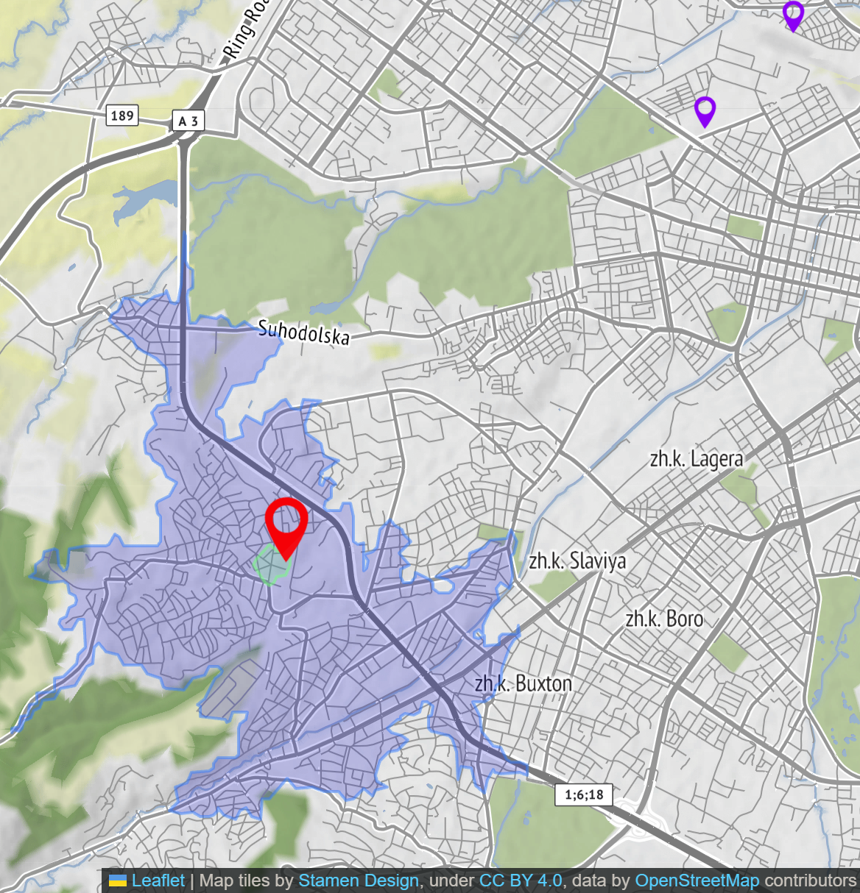

# [PostGIS](https://postgis.net/) към Уеб 

Този проект предоставя решение за визуализация на геопространствени данни от [PostGIS](https://postgis.net/) база данни върху интерактивна уеб карта. Той демонстрира ефективен начин за преобразуване на географска информация от база данни в динамично уеб приложение, достъпно за крайни потребители.

## 🎯 Основна цел

Проектът показва колко е лесно (през 2025) извеждането на географски обекти (точки, линии, полигони), съхранени в PostGIS или [DuckDB](https://duckdb.org/). Текущата реализация извлича данни от таблицата `public.jp_gari` и ги показва на уебкартата. Тези данни по произход са от Софияплан към Столична община.

## 🗺️ Взаимодействия с картата

- Потребителите могат да избират между различни базови карти, за да променят визуалния фон. 
- При посочване на маркер се показва неговото търговско наименование.
- При избор на маркер се пресмятат и показват изолинии за обхват според максимално време на придвижване (пеша или с автомобил) около избраната точка.

Освен това, картата позволява взаимодействие с полигони и линии. При кликване или посочване на такъв обект, неговото търговско наименование се извежда, а визуалният му стил се променя за по-добра видимост. Лентата за състояние в долната част на екрана дава информация за заглавието на мястото.



_заб. оцветената част е изохрон на достижимост  с кола и време 5мин, а вътре в него е пешеходната доситжимост_
_заб. достъпност му казват урбанистите, ама реално е до къде можем да стигнем за някакво време, а не дали имаме достъп.

## 🛠️ Използвани технологии

*   **Бекенд:** Python ([Flask](https://flask.palletsprojects.com/)), Node.js (Express.js), DuckDB (Node.js)
*   **База данни:** PostgreSQL, PostGIS, DuckDB
*   **Фронтенд:** HTML, CSS, JavaScript ([LeafletJS](https://leafletjs.com/))

## 🚀 Стартиране

### 1. Настройване на достъп до СУБД (PostGIS):

*   Използваме учебната база, която е достъпна през услугите на Koyeb. Ако нямате достъп, за улеснение можете да използвате предоставения `jp_gari_dump.sql` файл за създаване и попълване на таблицата. 
  
*   Уверете се, че съществува таблица `public.jp_gari`, съдържаща колона `geom` (тип геометрия) и `tradename` (текстово поле за наименование). 
  
*   Създайте `.env` файл в основната директория на проекта (може да копирате `.env.example`, ако е наличен) и попълнете следните променливи за връзка с базата данни:
    ```env
    PGUSER=потребител
    PGHOST=адрес_на_сървъра
    PGDATABASE=име_на_базата_данни
    PGPASSWORD=вашата_парола
    PGPORT=5432 # или друг порт, ако е конфигуриран
    PGCLIENTENCODING=UTF8

    PYTHON_PORT=8686 # Порт за уеб сървъра
    
    GEOAPIFY_API_KEY= # ключ за достъп до тази услуга
    DUCKDB_FILE=jp_gari.duckdb

    ```

### 2. Необходими библиотеки:

#### Решение с Python:
*   Инсталирайте необходимите Python пакети. Ако е наличен `requirements.txt` файл:
    ```bash
    pip install -r requirements.txt
    ```

#### Решение с Node.js:
*   Уверете се, че имате инсталирани Node.js и npm.
*   Инсталирайте зависимостите от `package.json` (ако е наличен):
    ```bash
    npm install
    ```
    (Ако няма `package.json`, може да се наложи ръчно инсталиране на пакети като `express`, `pg` и др.)

### 3. Стартиране на приложението:

Изберете един от вариантите:

#### Python бекенд:

    ```bash
    python srv/postgis2web.py
    ```

#### Node.js бекенд с Postgis:

    ```bash
    npm run start-postgis
    ```

#### Node.js бекенд с DuckDB:

    ```bash
    npm run start-duckdb
    ```

*   След стартиране на избрания сървър, отворете `http://localhost:8686` (или конфигурирания порт в `.env` - `PYTHON_PORT`).

## 🛠️ Архитектура

*   **Сървър:** Проектът предлага три реализации на бекенда:
    *   **Python (PostGIS):** Използва Flask за осигуряване на API крайна точка (`/gari`), която връща данни във формат GeoJSON.
    *   **Node.js (PostGIS):** Използва Express.js или подобна рамка за същата функционалност. Използва PostgreSQL.
    *   **Node.js (DuckDB):** Използва локална DuckDB база, без да разчита на PostgreSQL сървър.

*   **Фронтенд:** Използва стандартен HTML (`public/index.html`), JavaScript (`public/gislogic.js`) за логиката на картата и CSS за стилизация. Картата се изгражда с помощта на библиотеката [LeafletJS](https://leafletjs.com/).

*   **База данни:** PostGIS или DuckDB.

## 🦆 DuckDB демонстрация

Проектът включва демонстрация за работа с DuckDB. За да използвате тази функционалност:

1.  **Добиване на данни:** Пуснете `import_pg_to_duckdb.js`, за да пренесете данните от PostGIS в DuckDB. Това ще създаде файла `jp_gari.duckdb`.
    ```bash
    node import_pg_to_duckdb.js
    ```
2.  **Стартиране на DuckDB бекенд:** Пуснете `duckdb2web.js`, за да стартирате сървъра, който се обслужва с данни от DuckDB.
    ```bash
    node duckdb2web.js
    ```
    След стартиране данните ще бъдат достъпни на `http://localhost:8686/` (или конфигурирания порт). Иначе работят идентично.

## 🗺️ Демонстрирани функции на Leaflet

`gislogic.js` демонстрира следните Leaflet възможности:

-   **Инициализация на карта:** `L.map` за създаване и управление на екземпляра на картата.
-   **Слоеве с плочки:** `L.tileLayer` за добавяне на различни основни карти (OpenStreetMap, Esri, CartoDB, Stamen).
-   **Управление на слоеве:** `map.removeLayer` за динамична промяна на основата на картата.
-   **Персонализирани икони:** `L.icon` за персонализирани маркери въз основа на файлове с изображения.
-   **Групи слоеве:** `L.layerGroup` за организиране и общо управление на множество слоеве.
-   **Интеграция на GeoJSON:** `L.geoJSON` за анализиране и показване на GeoJSON данни на картата.
-   **Маркери:** `L.marker` за поставяне на интерактивни маркери на картата.
-   **Обработка на събития:** `marker.on` и `map.on` за обработка на потребителски взаимодействия като събития при преместване на мишката, излизане на мишката и щракване върху маркери и картата.
-   **Граници на картата:** `map.fitBounds` за регулиране на изгледа на картата, за да пасне на обхвата на GeoJSON данните.

## ⚙️ Начално настройване

Основните параметри за връзка с базата данни и портът на уеб сървъра се управляват чрез променливи на средата в `.env` файла.

---

## Лиценз

Този проект е лицензиран под Creative Commons Attribution-ShareAlike 4.0 International License.

[](https://creativecommons.org/licenses/by-sa/4.0/)
